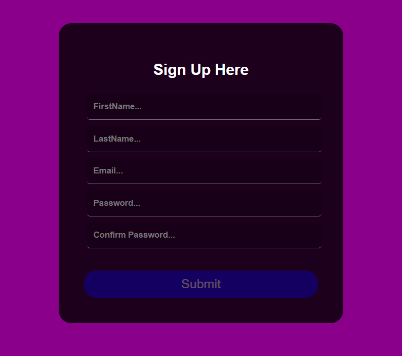

**FORMIK PROJECT**

**Formik** is a powerful library for managing forms in React. It
simplifies form state management, validation, and submission. By
integrating **Formik** into your project, you can easily handle form
data, ensure input validation with a schema, and streamline form
submission.

You can set up Formik by wrapping your form with the \<Formik\>
component or using the useFormik hook. This allows you to manage form
state and actions effortlessly. Formik also supports validation,
ensuring that user inputs are correct before submission.

